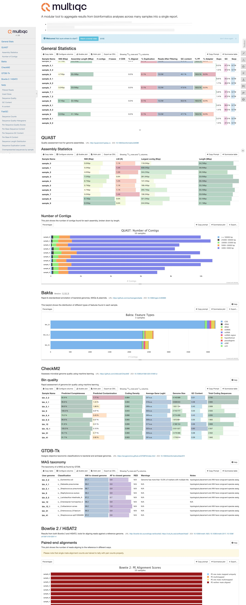

This CLI generates [MultiQC](https://docs.seqera.io/multiqc) report(s) from the pipeline results.
It only works with tools supported by MultiQC that are included in the pipeline:

- Bowtie2 (for decontamination step)
- FastQC (results after preprocessing)
- fastp (fastplong is not supported by MultiQC [for now](https://github.com/MultiQC/MultiQC/issues/3121))
- QUAST (assembly stats)
- CheckM2 (quality metrics of MAGs produced from the entire dataset, not the bins produced from individual samples)
- GTDB-Tk (taxonomical annotation of MAGs)
- Bakta (MAGs annotation: CDS, rRNA, tRNA...)

Example (excerpt):



# How to use?

Use the [`generate_multiqc_report.py`](generate_multiqc_report.py) script.

```
 Usage: generate_multiqc_report.py [OPTIONS]                                                                                                                                                                                                                                            
                                                                                                                                                                                                                                                                                        
 Generates MultiQC report(s) based on the pipeline results collected from the specified directories.                                                                                                                                                                                    
                                                                                                                                                                                                                                                                                        
                                                                                                                                                                                                                                                                                        
╭─ Options ────────────────────────────────────────────────────────────────────────────────────────────────────────────────────────────────────────────────────────────────────────────────────────────────────────────────────────────────────────────────────────────────────────────╮
│ *  --results-dir                 TEXT     Directory containing the results of the pipeline. [default: None] [required]                                                                                                                                                               │
│ *  --log-dir                     TEXT     Directory containing the logs of the pipeline. [default: None] [required]                                                                                                                                                                  │
│ *  --output-dir                  TEXT     Directory where the MultiQC report will be generated. [default: None] [required]                                                                                                                                                           │
│    --ani                         INTEGER  ANI threshold used for dereplicating MAGs. [default: 95]                                                                                                                                                                                   │
│    --multiqc-config              TEXT     Path to the MultiQC configuration file. [default: multiqc_config.yaml]                                                                                                                                                                     │
│    --dry-run             -d               If set, only prints the MultiQC command without executing it.                                                                                                                                                                              │
│    --install-completion                   Install completion for the current shell.                                                                                                                                                                                                  │
│    --show-completion                      Show completion for the current shell, to copy it or customize the installation.                                                                                                                                                           │
│    --help                                 Show this message and exit.                                                                                                                                                                                                                │
╰──────────────────────────────────────────────────────────────────────────────────────────────────────────────────────────────────────────────────────────────────────────────────────────────────────────────────────────────────────────────────────────────────────────────────────╯
```

It makes use of  `results/` and `logs/`, so do not remove the logs if you want the maximum of results in the report.

It will detect and collect the available results from supported tools, making symlinks with adapted filenames if needed, run MultiQC on those, producing several reports if needed (eg. if the pipeline was run in parallel for various assemblers).

# Tests

TODO.

# Reference

**MultiQC: Summarize analysis results for multiple tools and samples in a single report.** <br> _Philip Ewels, Måns Magnusson, Sverker Lundin and Max Käller_ <br>
Bioinformatics (2016) <br>